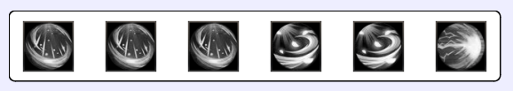
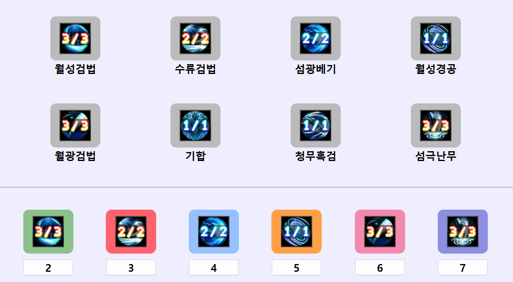
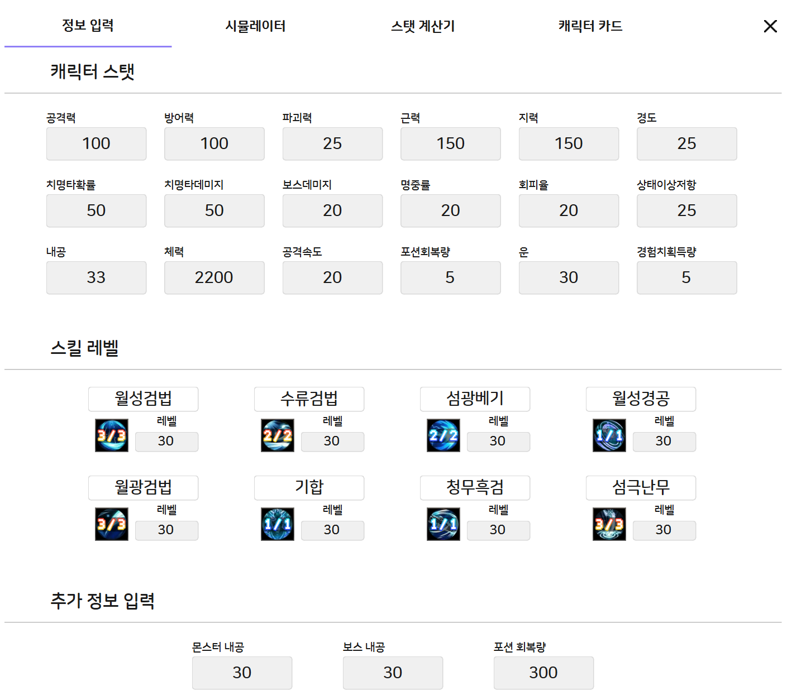
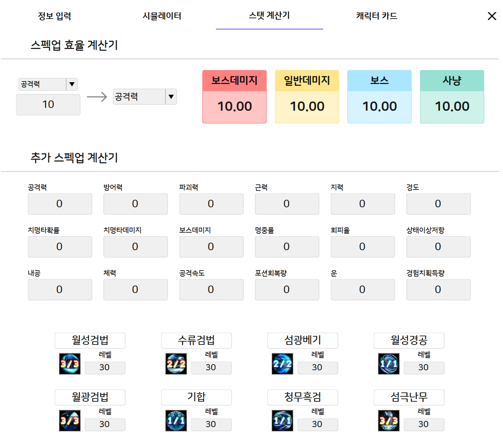
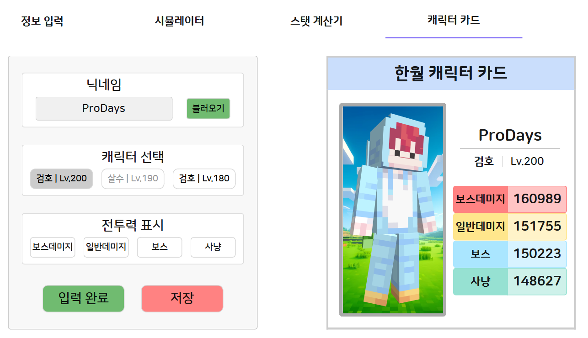

#  데이즈 스킬매크로 

투다이스 서버에서의 사냥을 편리하게 만들기 위한 스킬매크로입니다.

## 목차
1. [주의사항](#주의사항)
2. [프로그램 소개](#프로그램-소개)
3. [설치 방법](#설치-방법)
4. [기능 설명](#기능-설명)
5. [제작자](#제작자)
6. [업데이트 내역](#업데이트-내역)
7. [업데이트 예정](#업데이트-예정)
8. [라이센스](#라이센스)

## 주의사항

#### 본 프로그램을 사용함으로써 사용자는 아래 사항에 동의하는 것으로 간주됩니다.

* 본 프로그램의 사용으로 인한 모든 불이익에 대해 제작자는 책임을 지지 않습니다.

* 본 프로젝트는 제작자의 재량에 따라 언제든지 비공개 상태로 전환될 수 있습니다.

## 프로그램 소개

* 데이즈 스킬매크로는 투다이스 서버에서의 사냥을 편리하게 만들기 위한 스킬매크로입니다.

* 사용자의 직업과 사용중인 스킬을 선택해서 자신만의 스킬매크로를 설정할 수 있습니다.

* 각 행동 사이의 딜레이, 쿨타임 감소, 시작키 등의 설정을 변경할 수 있습니다.

* 각 스킬에 대해 여러가지 기능들을 조절해서 스킬의 사용 순서를 설정할 수 있습니다.

* 연계스킬을 만들어서 매크로 실행중이 아닐 때도 편리하게 스킬을 사용할 수 있습니다.

* 캐릭터 스탯, 스킬 레벨 등을 입력하여 매크로 시뮬레이션을 작동시켜 캐릭터의 전투력 지표를 확인할 수 있습니다.

* 입력된 캐릭터 정보를 바탕으로 스탯 효율, 추가 스펙업 계산, 잠재능력 효율 등을 확인할 수 있습니다.

* 캐릭터 닉네임, 직업, 레벨을 선택하여 캐릭터의 전투력을 자랑할 수 있는 캐릭터 카드를 제작할 수 있습니다.

## 설치 방법

* OneFile
    - 다운로드 후 실행하면 바로 사용 가능합니다.

* Installer

    

    - Installer 파일 실행 시, 윈도우 디펜더 창이 나타나면 "추가 정보" -> "실행"을 선택하여 설치를 진행합니다.

    - "다음" -> "동의함" -> "설치"를 클릭하면 프로그램이 설치됩니다.

## 기능 설명

### 주요 기능
- **스킬 매크로:** 자동 스킬 사용.
- **시뮬레이션 계산기:** 캐릭터 전투력 계산 및 DPS 분석.

### 설정

* 서버 - 직업
    * 투다이스 서버의 서버와 직업을 선택합니다.
    * 새로운 서버가 오픈될 경우 새 항목이 추가될 수 있습니다.

* 딜레이
    * 스킬을 사용하기 위한 키보드 입력, 마우스 클릭과 같은 동작 사이의 간격을 설정합니다.
    * 단위는 밀리초(0.001초) 단위로 50~1000 범위 내에서 설정 가능합니다.
    * 딜레이를 계속해서 조절하며 1분간 매크로를 실행했을 때 놓치는 스킬이 없도록 설정해주세요.

* 쿨타임 감소
    * 캐릭터의 쿨타임 감소 스탯입니다.
    * 입력 가능한 쿨타임 감소 스탯의 범위는 0~50입니다.

* 시작키 설정
    * 매크로를 시작하기 위한 키입니다.
    * 쓰지 않는 키로 설정한 후, 로지텍 G 허브와 같은 프로그램으로 마우스의 버튼에 매핑하는 것을 추천합니다.

* 마우스 클릭
    * 스킬 사용시: 스킬을 사용하기 위해 마우스를 클릭합니다. 평타를 사용하기 위한 클릭은 하지 않습니다.
    * 평타 포함: 스킬과 평타를 사용하기 위해 마우스를 클릭합니다.

 

### 스킬 사용설정

* 사용 여부
    * 매크로가 작동 중일 때 자동으로 스킬을 사용할지 결정합니다.
    * 이동기같이 자신이 직접 사용해야 하는 스킬만 사용을 해제하시는 것을 추천드립니다.
    * 연계스킬에는 적용되지 않습니다.

* 단독 사용
    * 연계스킬을 대기할 때 다른 스킬들이 준비되는 것을 기다리지 않고 우선적으로 사용할 지 결정합니다.
    * 연계스킬 내에서 다른 스킬보다 너무 빠르게 준비되는 스킬은 사용을 해제하시는 것을 추천드립니다.
    * 사용여부가 활성화되지 않았다면 단독으로 사용되지 않습니다.

* 콤보 횟수
    * 매크로가 작동 중일 때 한 번에 스킬을 몇 번 사용할 지를 결정합니다.
    * 콤보가 존재하는 스킬에 사용하는 것을 추천합니다.
    * 연계스킬에는 적용되지 않습니다.

* 우선 순위
    * 매크로가 작동 중일 때 여러 스킬이 준비되었더라도 우선순위가 더 높은(숫자가 낮은) 스킬을 먼저 사용합니다.
    * 우선순위를 설정하지 않은 스킬들은 준비된 시간 순서대로 사용합니다.
    * 버프스킬의 우선순위를 높이는 것을 추천합니다.
    * 연계스킬은 우선순위가 적용되지 않습니다.

 

### 스킬 연계설정

\* 연계스킬은 여러 스킬을 하나의 스킬처럼 사용하는 기능입니다.

* 연계 유형
    * 자동: 매크로가 실행 중일 때 자동으로 연계 스킬을 사용합니다. 자동 연계스킬에 사용되는 스킬은 다른 자동 연계스킬에 사용될 수 없습니다.
    * 연계스킬은 매크로 작동 여부와 관계 없이 단축키를 입력해서 작동시킬 수 있습니다.

* 단축키
    * 매크로가 실행 중이지 않을 때 해당 연계스킬을 작동시킬 단축키입니다.

* 스킬

    
    
    * 연계스킬을 구성하는 스킬의 목록과 사용 횟수를 설정할 수 있습니다.
    * 하나의 스킬이 너무 많이 사용되면 연계가 정상적으로 작동하지 않을 수 있습니다.

 

### 메인 화면

* 스킬 탭

    

    * 스킬 탭을 추가해서 여러가지 프리셋을 설정할 수 있습니다.

* 스킬 프리뷰

    

    * 스킬 프리뷰에서 매크로를 실행했을 때 스킬이 어떤 순서로 실행되는지 확인할 수 있습니다.
    * 매크로가 실행중이지 않으면 스킬 아이콘이 흑백이고, 실행중이라면 아이콘이 컬러로 바뀝니다.

* 스킬 장착

    

    * 캐릭터가 사용하는 스킬들을 장착하고 스킬을 사용하는 단축키를 설정합니다.

 

### 버전 확인

* 프로그램을 실행했을 때, 프로그램이 최신버전인지 확인합니다.

* 최신버전이 아니라면 "다운로드 링크" 버튼을 눌러서 최신버전을 다운로드 받을 수 있습니다.

 

### 시뮬레이션 계산기

* 정보 입력

    

    * 시뮬레이션을 작동시킬 정보를 입력합니다.

* 시뮬레이터

    

    * 메인 화면의 스킬 정보와 시뮬레이션 계산기에서 입력된 정보를 기반으로 스킬 사용 시뮬레이션을 1000회 작동시킵니다.

    * 캐릭터의 보스데미지, 일반데미지, 보스, 사냥 전투력을 확인할 수 있습니다.

    * 초당 피해량, 총 피해량
        * 최소, 최대, 표준편차와 25, 50, 75 백분위수를 확인할 수 있습니다.

    * DPM 분포
        * 총 보스피해량의 분포를 확인할 수 있습니다.

    * 스킬 비율
        * 총 피해량에 대한 각 스킬의 비율을 확인할 수 있습니다.

    * 시간 경과에 따른 피해량
        * 각 시간의 최대, 최소, 평균 피해량을 확인할 수 있습니다.

    * 누적 피해량
        * 각 시간의 최대, 최소, 평균 누적 피해량을 확인할 수 있습니다.

    * 스킬별 기여도
        * 각 시간의 스킬별 피해량 비율을 확인할 수 있습니다.

* 스탯 계산기

    

    * 스펙업 효율 계산기
        * 두 스탯의 효율을 비교합니다.

    * 추가 스펙업 계산기
        * 추가적으로 스펙업을 했을 경우의 전투력 정보를 확인할 수 있습니다.

    * 잠재능력 계산기
        * 3가지 잠재능력이 설정되었을 경우의 전투력 상승량을 확인할 수 있습니다.

    * 잠재능력 옵션 순위표
        * 잠재능력 옵션별 전투력 상승량과 순위를 확인할 수 있습니다.

* 캐릭터 카드

    

    * 캐릭터와 표시할 전투력 종류를 선택하여 캐릭터 카드를 생성하고 저장할 수 있습니다.

## 제작자

* [@ProDays](https://github.com/Pro-Days)

## 업데이트 내역

* 3.1.0-beta.1

    * 전투력 계산기 시스템을 추가했습니다.

    * 매크로 작동 방식을 변경했습니다.

    * 연계스킬 단축키에 "설정 안함" 버튼을 추가했습니다.

    * 라이센스를 변경했습니다.

* v3.0.1

    * VirusTotal에서 실행 프로그램을 바이러스로 오탐하는 현상을 일부 제거했습니다.

* v3.0.0

    * 시작키를 변경할 때 키가 중복이 될 경우 변경하지 못하도록 변경했습니다.

    * 프로그램 아이콘을 변경했습니다.

    * 프로그램을 실행했을 때 나타나는 위치를 변경했습니다.

    * 스킬 탭을 삭제할 때 "아니오"를 선택해도 삭제되는 현상을 제거했습니다.

    * 스킬 탭을 삭제할 때 탭 이름이 너무 길 경우 텍스트가 정상적으로 표기되지 않는 현상을 제거했습니다.

    * 스킬 연계설정 창에서 장착중이던 스킬을 해제했을 때 해당 스킬이 포함된 자동 연계스킬이 수동으로 변경되었지만 자동으로 표시되는 현상을 제거했습니다.

    * 스킬 연계설정 창에서 자동 연계스킬의 색을 빨강, 수동 연계스킬의 색을 파랑으로 변경했습니다.

    * 단축키에 "Print Screen"이 "Print"로 표시되던 것을 "PrtSc"로, "Scroll Lock"이 "Scroll"으로 표시되던 것을 "ScrLk"로 표시되도록 변경했습니다.

    * 단축키에 "Ctrl"이 "Crtl"로 표시되던 것을 수정했습니다.

    * 단축키에 "Print Screen", "Scroll Lock" 키가 설정되어있을 때 키가 사용중이라고 뜨지 않는 현상을 제거했습니다.

    * 특정 키들을 입력했을 때 입력을 감지하지 못하는 현상을 제거했습니다.

* v3.0.0-beta.3

    * 탭을 제거할 때 확인창이 뜨도록 수정했습니다.

    * onefile과 installer를 선택해서 사용할 수 있도록 했습니다. (OneFile은 Window Defender가 바이러스로 오진하는 문제가 발생해서 사용하기 어렵습니다.)

## 업데이트 예정

1. 인게임에 따른 스킬 정보, 스탯 정상입력 확인, 전투력 공식 업데이트 (서버 오픈 이후)

1. 직업 시스템 -> 무기 스왑 시스템으로 변경

1. 매크로 설정 추가
    * 최신버전 확인 On/Off

1. 매크로 공유 기능 추가

1. 시뮬레이션 실행 시 메모리 누수 제거

## 라이센스

이 프로젝트는 GPL 3.0 라이센스로 라이센스가 부여되어 있습니다. 자세한 내용은 [LICENSE](LICENSE) 파일을 참고해주세요.