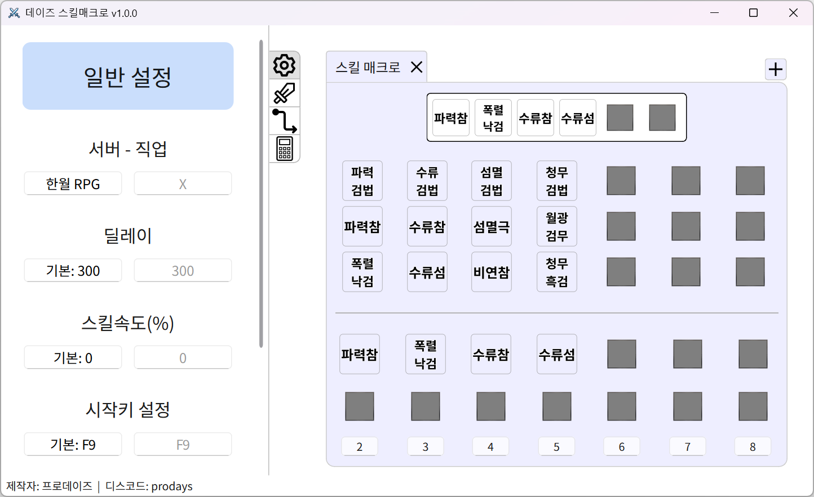
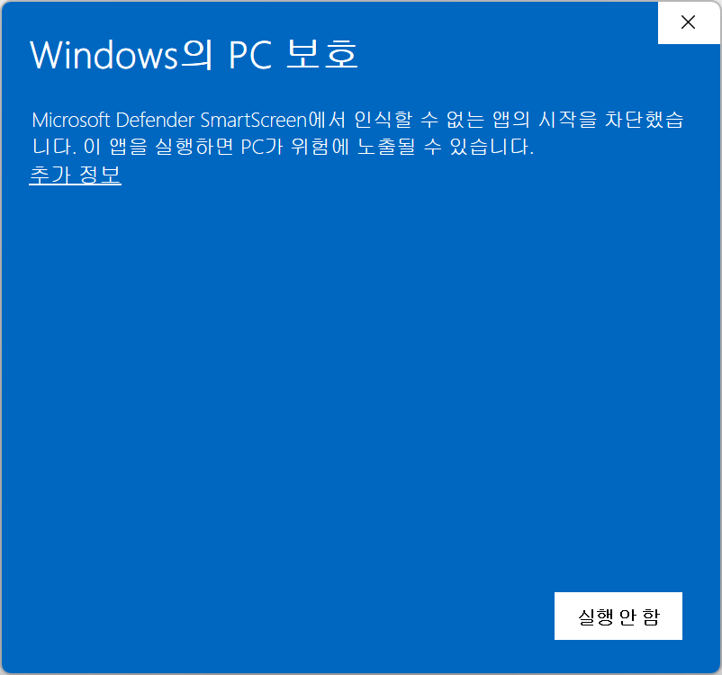
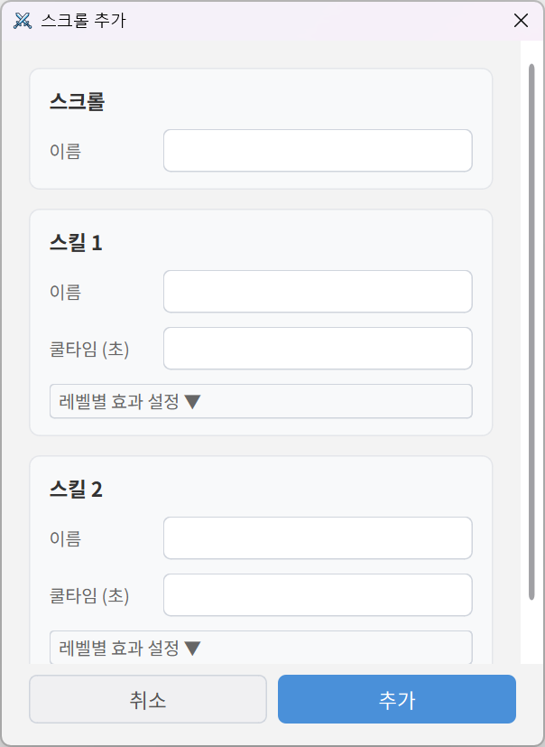
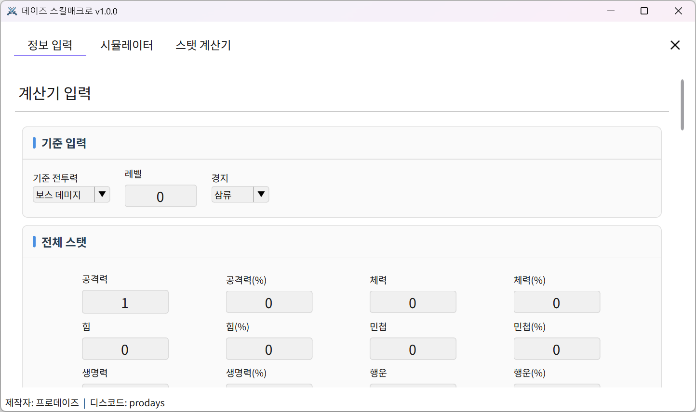
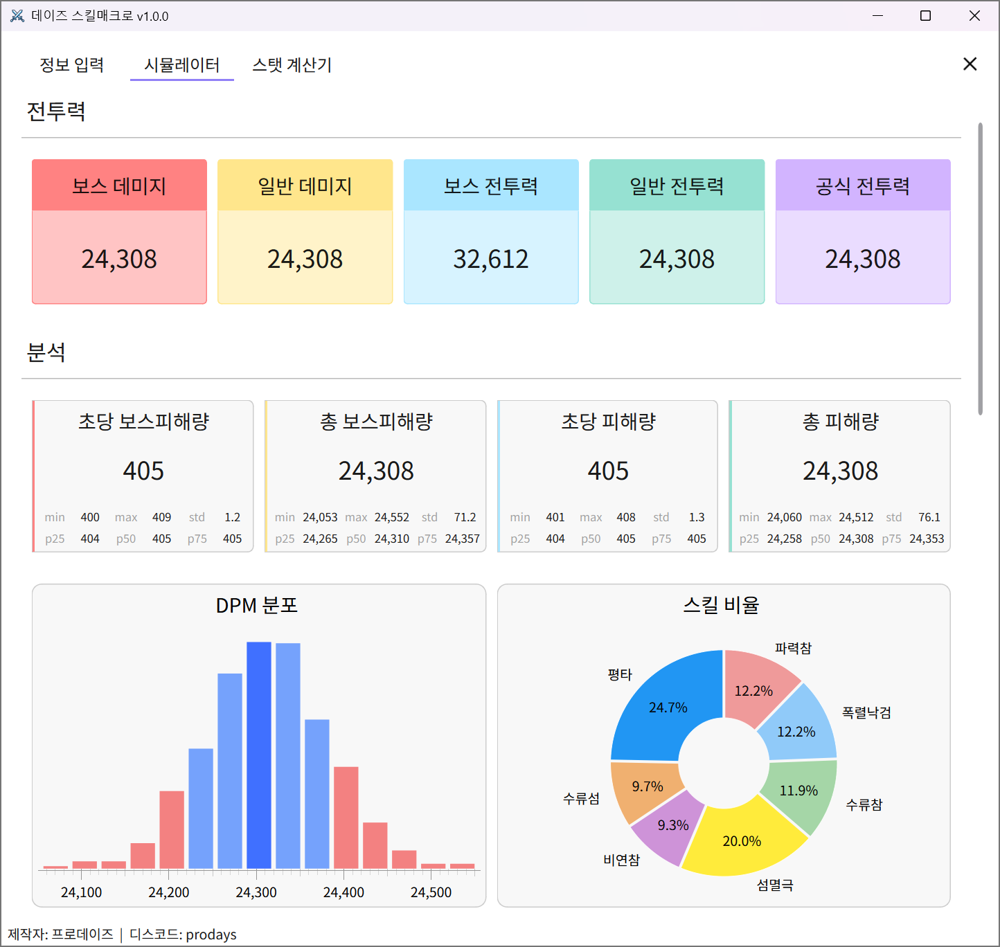
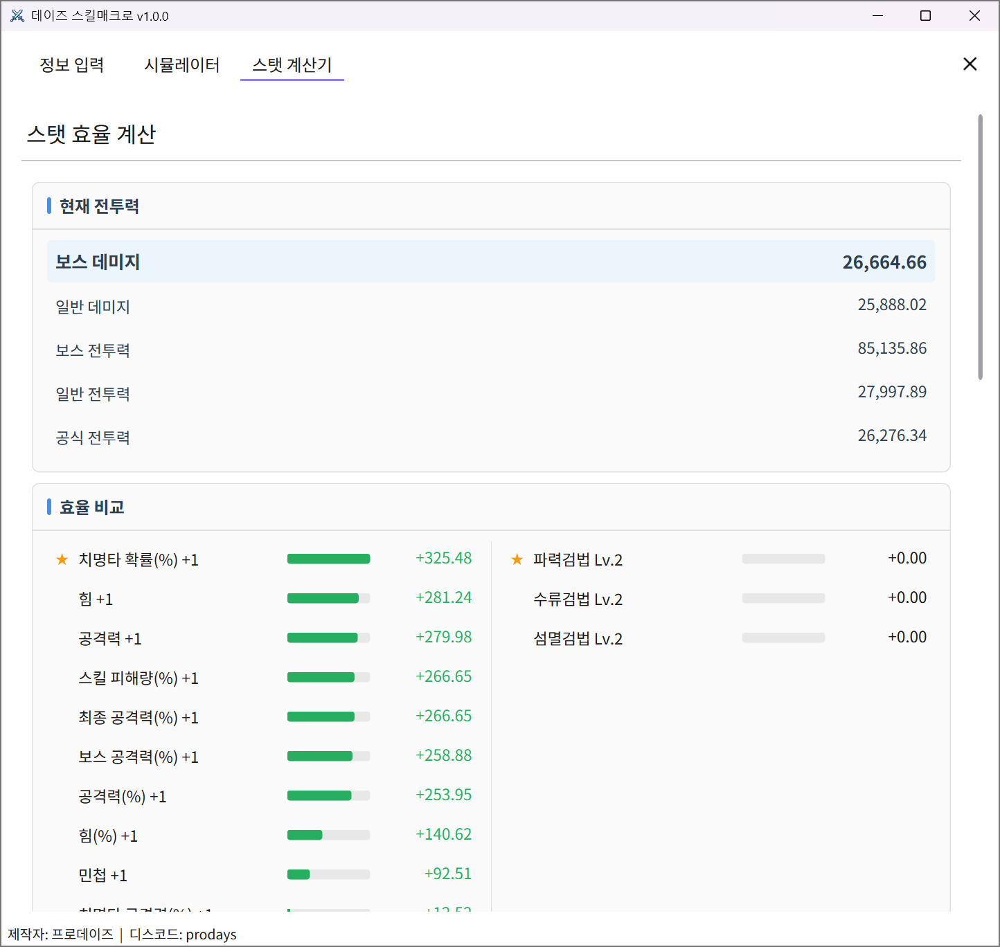

# 데이즈 스킬매크로



한월 RPG용 스킬 매크로 프로그램입니다.  

## 주의사항

- 본 프로그램의 사용으로 인한 모든 불이익에 대해 제작자는 책임을 지지 않습니다.
- 본 프로젝트는 제작자의 재량에 따라 언제든지 비공개 상태로 전환될 수 있습니다.
- 공식적인 경로로 배포된 파일 외의 출처에서 프로그램을 다운로드하거나 실행함으로 인해 발생하는 모든 문제에 대한 책임은 본인에게 있습니다.
- 서버 약관에 따라 매크로를 사용하는 것은 허용되나, 잠수/무적자리에서 매크로를 사용하는 것은 엄격히 금지됩니다.
- 본 프로그램은 GPL-3.0 라이선스 하에 배포됩니다. 소스 코드의 수정 및 재배포는 자유로우나, 배포 시에는 반드시 전체 소스 코드를 동일한 라이선스로 공개해야 할 의무가 있습니다.

## 지원 범위

- 운영체제: `Windows`
- 현재 기본 서버: `한월 RPG`
- 실행 방식: 배포 파일 실행 또는 Python 직접 실행

## 이미지 교체 위치

README에 연결된 이미지는 모두 교체용 플레이스홀더입니다.  
아래 파일을 같은 이름으로 덮어쓰면 문서 이미지가 바로 교체됩니다.

## 주요 기능

- 스킬 매크로 설정 및 실행
- 시뮬레이터 그래프 확인
- 스탯 효율, 스크롤 강화 효율, 성장 효율, 최적화 결과 계산
- 커스텀 스크롤 / 커스텀 스킬 추가, 수정, 삭제

## 설치 및 실행

### 배포 파일 사용

- 저장소: [Pro-Days/SkillMacro](https://github.com/Pro-Days/SkillMacro)
- 배포 페이지: [Releases](https://github.com/Pro-Days/SkillMacro/releases)

배포 파일을 받았다면 실행 후 바로 사용할 수 있습니다. 실행 시 최신 버전 확인 기능이 동작하며, 새 릴리스가 있으면 안내 팝업이 표시됩니다.

#### 설치 시 주의사항


- 윈도우 디펜더에서 경고가 표시된다면 "추가 정보" -> "실행"을 선택해야 합니다.
- 공식 배포 채널 외에서 파일을 받았다면, 해당 파일이 안전한지 반드시 확인한 후 실행해야 합니다.

### 소스코드 직접 실행

```bash
pip install -r requirements.txt
python SkillMacro.py
```

## 화면 구성


프로그램은 크게 두 영역으로 나뉩니다.

- 왼쪽: 설정 사이드바
- 오른쪽: 프리셋 탭, 스크롤 장착, 스킬 배치, 스킬 프리뷰

왼쪽 네비게이션에서 이동 가능한 화면은 다음과 같습니다.

- `일반 설정`
- `스킬 사용설정`
- `스킬 연계설정`
- `시뮬레이션`

오른쪽 상단 탭은 프리셋입니다. 탭 추가 버튼으로 새 프리셋을 만들 수 있고, 현재 탭 이름은 클릭해서 변경할 수 있습니다.

## 기능 상세

### 1. 일반 설정

`일반 설정`에서는 현재 프리셋 단위의 기본 동작을 설정합니다.

- `서버 - 직업`
  - 현재 사용할 서버를 선택합니다.
  - 현재 기준 서버는 오직 `한월 RPG`만 존재합니다.
- `딜레이`
  - 키 입력, 마우스 클릭 등 각 동작 사이 간격입니다.
  - 스킬을 놓치지 않는 값을 입력해야 합니다.
  - 단위는 밀리초(ms)입니다.
- `스킬속도(%)`
  - 캐릭터의 스킬속도(%) 스탯을 입력합니다.
- `시작키 설정`
  - 매크로 시작 / 중지에 사용하는 키입니다.
  - 기본값은 `F9`입니다.
- `스왑키 설정`
  - 2줄 스킬 전환에 사용하는 키입니다.
  - 기본값은 `` ` ``입니다.
- `마우스 클릭`
  - `평타 사용 안함`: 평타 입력을 사용하지 않습니다.
  - `평타 사용`: 평타 입력을 포함합니다.

### 2. 메인 화면: 스크롤 장착과 스킬 배치

메인 화면은 실제 매크로 구성을 만드는 영역입니다.

- 상단: 스크롤 장착 영역
- 하단: 장착한 스킬의 실제 사용 배치 영역
- 하단 키 버튼: 각 스킬 라인의 입력 키
- 프리뷰: 현재 세팅 기준 실행 순서 확인

#### 스크롤 장착 방법

1. 스크롤 슬롯을 클릭합니다.
2. 스크롤 선택 팝업에서 장착할 스크롤을 선택합니다.
3. 이미 다른 슬롯에서 사용 중인 스크롤은 중복 선택할 수 없습니다.
4. 메인 화면 상단의 현재 슬롯 버튼을 한 번 더 클릭하면 장착이 해제됩니다.

#### 스킬 배치 방법

1. 상단에서 스크롤을 장착합니다.
2. 해당 스크롤이 제공하는 스킬 2개가 배치 가능한 상태가 됩니다.
3. 하단 슬롯에 원하는 순서대로 스킬을 배치합니다.

#### 스킬 키

기본 스킬 키는 `2`부터 순서대로 생성됩니다.  
각 라인의 키 버튼을 눌러 변경할 수 있습니다.

### 3. 스킬 사용설정

`스킬 사용설정`은 선택한 스크롤의 두 스킬에 대한 실행 규칙을 지정하는 화면입니다.

- `사용 여부`
  - 매크로에서 해당 스킬을 사용할지 결정합니다.
  - `사용 안함`으로 설정한 스킬은 사용되지 않습니다.
- `단독 사용`
  - 다른 스킬 준비 상태를 기다리지 않고 우선적으로 사용할지 결정합니다.
- `우선 순위`
  - 숫자가 낮을수록 먼저 사용합니다.
- `단독 스왑`
  - 현재 줄에 없더라도 해당 스킬을 위해 즉시 스왑할지 결정합니다.

#### 스크롤별 설정 방법

1. 사이드바 상단의 선택된 스크롤 카드를 클릭합니다.
2. 설정할 스크롤을 선택합니다.
4. 표시된 두 스킬의 옵션을 각각 조정합니다.

현재 선택된 스크롤이 커스텀 스크롤이면 `수정`, `삭제` 버튼이 추가로 표시됩니다.

### 4. 연계스킬

연계스킬은 여러 스킬을 한번에 다루는 기능입니다.

- `자동`
  - 매크로 실행 중 자동으로 사용합니다.
  - 자동 연계에 들어간 스킬은 다른 자동 연계와 중복될 수 없습니다.
- `수동`
  - 매크로 실행 여부와 관계없이 지정한 단축키로 실행합니다.

#### 연계스킬 생성 방법

1. `스킬 연계설정`으로 이동합니다.
2. `새 연계스킬 만들기`를 클릭합니다.
3. `자동` 또는 `수동`을 선택합니다.
4. 필요하면 단축키를 지정합니다.
5. 스킬 추가 버튼으로 연계에 포함할 스킬을 넣습니다.
6. `저장`을 누릅니다.

#### 연계스킬 편집 규칙

- 같은 스킬을 연계 안에서 과도하게 반복하면 경고가 표시됩니다.
- 스킬 구성이 바뀌면 연계는 수동 모드로 설정됩니다.

### 5. 커스텀 스크롤 / 스킬 추가



기본 목록에 없는 스크롤을 직접 추가할 수 있습니다.

#### 진입 방법

1. 스크롤 선택 팝업을 엽니다.
2. 하단의 `+ 새 스킬 추가`를 클릭합니다.

#### 입력 항목

커스텀 스크롤 메뉴에서는 다음 값을 입력합니다.

- `스크롤 이름`
- `스킬 1 이름`
- `스킬 1 쿨타임(초)`
- `스킬 2 이름`
- `스킬 2 쿨타임(초)`
- 각 레벨별 효과

레벨별 효과는 아래 타입 중 하나로 설정합니다.

- `데미지`
- `힐`
- `버프`

버프를 선택하면 추가로 다음 값을 입력합니다.

- `스탯명`
- `수치`
- `지속 시간(초)`

### 6. 시뮬레이션

시뮬레이션 화면은 3개의 페이지로 나뉩니다.

- `정보 입력`
- `시뮬레이터`
- `스탯 계산기`

#### 6-1. 정보 입력



`정보 입력`은 계산의 기준 상태를 정의하는 페이지입니다.

입력 항목은 다음과 같습니다.

- `기준 전투력`
    - 스텟을 어떤 기준에 따라 최적화할지 결정하는 항목입니다.
- `레벨`
    - 캐릭터의 현재 레벨을 입력합니다.
- `경지`
    - 캐릭터의 현재 경지를 입력합니다.
- `전체 스탯`
    - 인게임의 "전체 스텟"의 모든 값들을 입력합니다.
- `스크롤 레벨`
    - 현재 장착중인 스크롤의 레벨을 입력합니다.
    - 커스텀 스크롤에서 레벨 효과를 입력하지 않았다면 해당 스크롤의 스킬 데미지는 모두 0으로 처리됩니다.
- `사용자 지정 스탯 변화량`
    - 현재 상태에서 추가로 가상의 스탯 변화량을 입력하는 항목입니다.
    - 예를 들어, 특정 스탯을 +100 올렸을 때 전투력이 얼마나 변하는지 확인할 때 사용합니다.
- `스탯 분배`
    - 캐릭터의 스텟 분배 상태를 입력합니다.
- `단전`
    - 캐릭터의 단전 상태를 입력합니다.
- `칭호 목록`
    - 현재 장착중인 칭호와 보유중인 칭호 목록을 입력합니다.
- `부적 목록`
    - 현재 장착중인 부적과 보유중인 부적 목록을 입력합니다.

#### 칭호 입력

- `칭호 추가`로 목록에 항목을 생성합니다.
- 목록에서 선택한 뒤 장착 상태로 지정한 칭호 1개가 현재 상태 계산에 반영됩니다.

#### 부적 입력

- `부적 추가`로 목록에 항목을 생성합니다.
- 각 부적은 등급, 종류, 레벨을 설정할 수 있습니다.
- 목록에서 선택한 뒤 장착 상태로 지정한 부적 3개가 현재 상태 계산에 반영됩니다.

#### 6-2. 시뮬레이터



`시뮬레이터` 페이지는 현재 프리셋과 정보 입력 상태를 기준으로 전투 흐름을 시각화합니다.

확인 가능한 주요 항목:

- 전투력
- 시뮬레이션 분석
- DPM 분포
- 스킬별 피해량 비율
- 시간 경과에 따른 피해량 그래프
- 누적 피해량
- 스킬별 기여도

#### 6-3. 스탯 계산기



`스탯 계산기` 페이지는 현재 상태와 추가 변화량을 비교하고, 스텟별 효율과 최적화 결과를 보여줍니다.

출력 항목은 다음과 같습니다.

- `현재 전투력`
- `효율 비교`
  - 스탯 1당 효율
  - 스크롤 +1레벨당 효율
- `성장 효율`
  - 레벨 1업
  - 다음 경지
- `사용자 지정 변화량 결과`
- `최적화 결과`

최적화 결과에는 현재 입력 기준으로 계산한 다음 항목이 포함됩니다.

- 최적 스탯 분배
- 최적 단전
- 최적 칭호
- 최적 부적
- 최적화 후 전체 스탯

## 저장 데이터

프로그램 설정은 자동 저장됩니다. 저장 위치는 다음과 같습니다.

- `%LOCALAPPDATA%\ProDays\SkillMacro\macros.json`
- `%LOCALAPPDATA%\ProDays\SkillMacro\custom_skills.json`

## 제작자

- GitHub: [@Pro-Days](https://github.com/Pro-Days)

## 라이선스

본 프로그램은 [GPL-3.0](LICENSE) 라이선스 하에 배포됩니다. 소스 코드의 수정 및 재배포는 자유로우나, 배포 시에는 반드시 전체 소스 코드를 동일한 라이선스로 공개해야 할 의무가 있습니다.