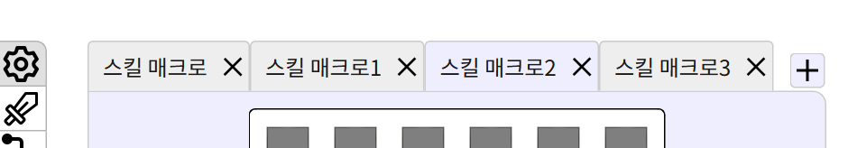
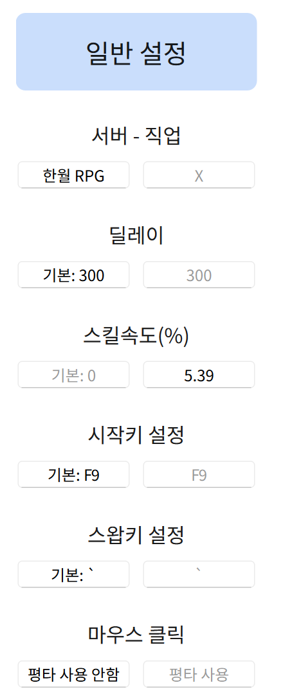
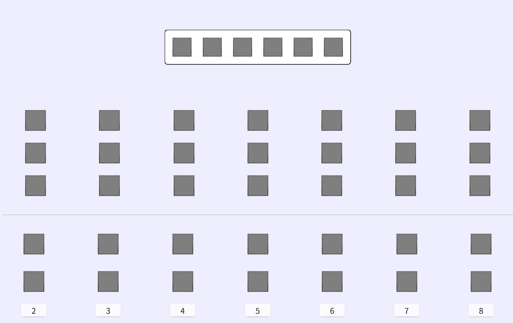
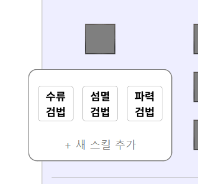
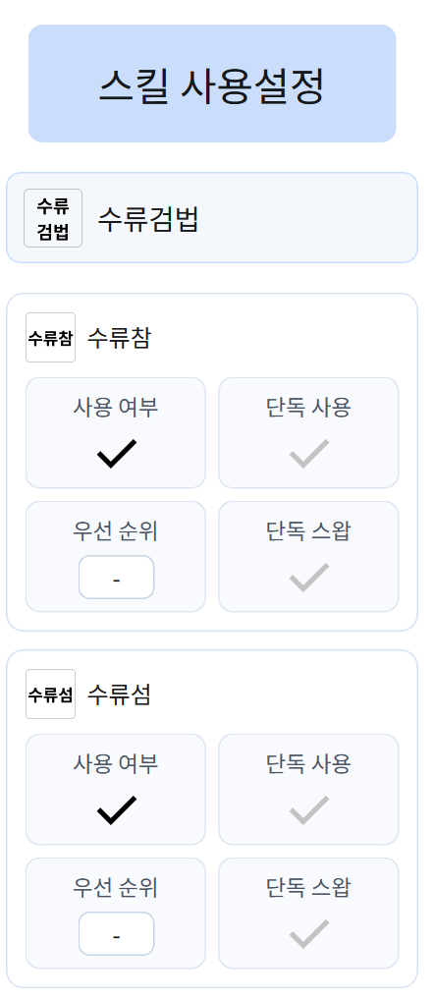
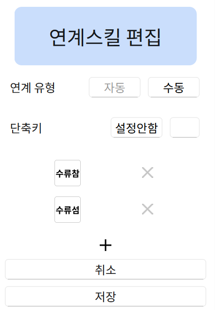
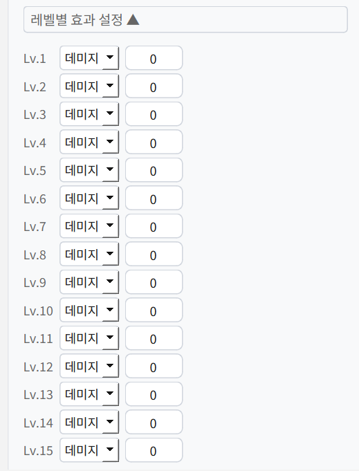
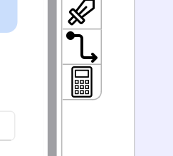

# 데이즈 스킬매크로


한월 RPG용 스킬 매크로 설정, 전투 시뮬레이션, 스탯 효율 계산을 한곳에서 다루는 프로그램입니다.  
처음 열었을 때는 화면 요소가 많아 보이지만, 실제 사용 흐름은 아래 순서로 보면 가장 쉽습니다.

## 주의사항

- 본 프로그램의 사용으로 인한 모든 불이익에 대해 제작자는 책임을 지지 않습니다.
- 본 프로젝트는 제작자의 재량에 따라 언제든지 비공개 상태로 전환될 수 있습니다.
- 공식적인 경로로 배포된 파일 외의 출처에서 프로그램을 다운로드하거나 실행함으로 인해 발생하는 모든 문제에 대한 책임은 본인에게 있습니다.
- 서버 약관에 따라 매크로를 사용하는 것은 허용되나, **잠수/무적자리에서 매크로를 사용하는 것은 엄격히 금지됩니다.**
- 본 프로그램은 GPL-3.0 라이선스 하에 배포됩니다. 소스 코드의 수정 및 재배포는 자유로우나, 배포 시에는 반드시 전체 소스 코드를 동일한 라이선스로 공개해야 할 의무가 있습니다.

## 설명 바로가기

### 일반 설정

- 딜레이: [바로가기](#delay-guide)
- 스킬속도(%): [바로가기](#skill-speed-guide)
- 스왑키 설정: [바로가기](#swap-key-guide)
- 마우스 클릭: [바로가기](#mouse-click-guide)

### 메인 화면

- 무공비급 장착 방법: [바로가기](#scroll-equip-guide)
- 스킬 배치 방법: [바로가기](#skill-placement-guide)
- 스킬 제거 방법: [바로가기](#skill-remove-guide)

### 스킬 사용설정

- 어떤 무공비급을 설정할지 고르는 법: [바로가기](#skill-settings-select-scroll)
- 각 옵션 뜻: [바로가기](#skill-settings-options)
- 우선 순위 버튼 읽는 법: [바로가기](#priority-guide)
- 커스텀 무공비급 수정 / 삭제: [바로가기](#custom-scroll-actions)

### 스킬 연계설정

- 연계설정이 무엇인지: [바로가기](#link-settings-overview)
- 자동 / 수동 차이: [바로가기](#link-auto-manual-guide)
- 편집 화면 설명: [바로가기](#link-editor-guide)

### 커스텀 무공비급 / 스킬

- 커스텀 스킬 생성 방법: [바로가기](#custom-skill-entry)
- 입력 화면 구성: [바로가기](#custom-skill-inputs)
- 레벨별 효과의 숫자: [바로가기](#custom-skill-level-value)

### 시뮬레이션 입력

- 기준 전투력: [바로가기](#metric-guide)
- 전체 스탯: [바로가기](#overall-stats-guide)
- 사용자 지정 스탯 변화량: [바로가기](#custom-delta-guide)

### 시뮬레이터 결과

- 시뮬레이터 페이지: [바로가기](#simulator-overview)

### 스탯 계산기 결과

- 스탯 계산기 페이지: [바로가기](#calc-overview)
- 현재 전투력: [바로가기](#calc-current-power-guide)
- 효율 비교: [바로가기](#calc-efficiency-guide)
- 성장 효율: [바로가기](#calc-growth-guide)
- 사용자 지정 변화량 결과: [바로가기](#calc-custom-guide)
- 최적화 결과: [바로가기](#calc-opt-guide)

## 빠른 사용 순서

1. 왼쪽 `일반 설정`에서 스킬속도, 시작키, 스왑키, 딜레이를 맞춘다.
2. 메인 화면 상단에 무공비급을 장착한다.
3. 하단 배치칸에 스킬을 원하는 순서로 넣는다.
4. 매크로를 실행한다.
5. 필요하면 `스킬 사용설정`, `스킬 연계설정`으로 동작 방식을 다듬는다.
6. `시뮬레이션`으로 이동해서 현재 캐릭터 정보를 입력하고 결과를 본다.

## 설치 및 실행

### 배포 파일 사용

- 저장소: [Pro-Days/SkillMacro](https://github.com/Pro-Days/SkillMacro)
- 배포 페이지: [Releases](https://github.com/Pro-Days/SkillMacro/releases)

배포 파일을 받았다면 실행 후 바로 사용할 수 있습니다. 실행 시 새 버전이 있으면 안내가 표시됩니다.


윈도우에서 경고 창이 나오면 `추가 정보` -> `실행`을 누르면 됩니다.

### 소스코드 직접 실행

```bash
pip install -r requirements.txt
python SkillMacro.py
```

## 화면 전체 구조


프로그램은 크게 네 영역으로 나뉩니다.

- 왼쪽 큰 영역: `일반 설정`, `스킬 사용설정`, `스킬 연계설정`, `시뮬레이션`으로 이동하는 사이드바
- 오른쪽 상단 탭: 프리셋
- 오른쪽 중앙 상단: 무공비급 장착 영역
- 오른쪽 중앙 하단: 실제 스킬 배치 영역과 실행 프리뷰

<a id="preset-tab"></a>

### 프리셋 탭



프리셋은 한 세트를 통째로 저장하는 단위입니다.  
딜레이, 키 설정, 무공비급 장착, 스킬 배치, 스킬 사용설정, 연계설정, 시뮬레이션 입력값까지 프리셋별로 따로 관리됩니다.

- 탭을 누르면 해당 프리셋으로 즉시 전환됩니다.
- `+` 버튼을 누르면 새 프리셋이 만들어집니다.
- 현재 탭 이름을 클릭하면 이름을 바꿀 수 있습니다.
- 탭 오른쪽 `X`를 누르면 해당 프리셋을 삭제합니다.

프리셋을 여러 개 만들어 두면 사냥용, 보스용, 테스트용 세팅을 따로 관리하기 편합니다.

---

<a id="general-settings"></a>

## 1. 일반 설정



`일반 설정`은 현재 프리셋의 기본 동작 방식을 정하는 곳입니다.  
처음 프로그램을 켰다면 가장 먼저 여기부터 확인하면 됩니다.

| 항목 | 의미|
| --- | --- |
| `서버 - 직업` | 현재 프리셋이 사용할 서버 데이터를 고릅니다. |
| `딜레이` | 키 입력과 클릭 사이에 들어가는 간격입니다. 스킬을 너무 빠르게 사용해 놓치는 스킬이 있다면 값을 올려주세요. |
| `스킬속도(%)` | 캐릭터의 현재 스킬속도 수치입니다. |
| `시작키 설정` | 매크로 시작과 중지에 쓰는 키입니다. |
| `스왑키 설정` | 2줄 스킬을 전환할 때 쓰는 키입니다. |
| `마우스 클릭` | 평타 입력을 포함할지 정합니다. |

### 각 항목을 보는 법

<a id="server-job-guide"></a>

#### 서버 - 직업

- 현재 프리셋이 어떤 서버 기준 데이터를 사용할지 정합니다.
- 이 값이 바뀌면 무공비급 목록과 스킬 데이터도 그 기준으로 바뀝니다.

<a id="delay-guide"></a>

#### 딜레이

- 스킬 사용 사이의 템포를 조절하는 칸입니다.
- 값이 작아질수록 입력이 빠르게 이어지고, 값이 커질수록 여유 있게 입력됩니다.
- 스킬을 놓치는 경우가 발생할 때 가장 먼저 조정하는 항목입니다.
- 처음 맞출 때는 `100`씩 올리면서 테스트해 보고, 잘 돌아가기 시작하면 다시 `50`씩 내려 보면서 가장 빠르게 안정적으로 돌아가는 값을 찾으면 쉽습니다.

<a id="skill-speed-guide"></a>

#### 스킬속도(%)

- 캐릭터 스탯창의 `스킬속도(%)`를 그대로 적는 칸입니다.

<a id="start-key-guide"></a>

#### 시작키 설정

- 기본값은 `F9`입니다.
- 이 키를 누르면 매크로 시작 또는 중지가 됩니다.
- 자주 누르기 편한 키로 바꿔 두면 사용이 훨씬 편합니다.

<a id="swap-key-guide"></a>

#### 스왑키 설정

- 기본값은 `H`입니다.
- 1줄과 2줄을 오가는 키를 적는 칸이라고 생각하면 됩니다.
- 2줄 스킬을 쓰는 세팅이라면 반드시 실제 인게임 설정과 맞춰 두는 것이 좋습니다.

<a id="mouse-click-guide"></a>

#### 마우스 클릭

- `평타 사용 안함`: 스킬만 사용합니다.
- `평타 사용`: 스킬 사이에 일반공격 클릭을 포함합니다.

---

## 2. 메인 화면



메인 화면은 실제 매크로 동작 순서를 만드는 곳입니다.  
위쪽은 “무엇을 쓸 수 있는지”, 아래쪽은 “어떤 순서로 배치할지”라고 생각하면 이해가 쉽습니다.

### 이 화면에서 보는 영역

- 상단: 무공비급 슬롯과, 그 무공비급이 제공하는 2개 스킬
- 하단: 실제로 매크로가 사용할 배치 슬롯
- 하단 맨 아래 작은 버튼: 각 줄의 입력 키
- 맨 위 가로 프리뷰: 현재 세팅으로 다음에 어떤 스킬이 나갈지 미리 보여주는 영역

<a id="scroll-equip-guide"></a>

### 무공비급 장착 방법



1. 상단의 빈 무공비급 슬롯을 클릭합니다.
2. 목록에서 원하는 무공비급을 고릅니다.
3. 장착이 끝나면 그 아래에 해당 무공비급의 스킬 2개가 표시됩니다.
4. 목록에 없는 무공비급을 추가하고 싶으면 `+ 새 스킬 추가`를 눌러서 만들 수 있습니다.

<a id="skill-placement-guide"></a>

### 스킬 배치 방법

1. 먼저 하단의 배치 슬롯 하나를 클릭합니다.
2. 클릭한 슬롯이 선택된 상태에서, 상단에 표시된 스킬 아이콘을 클릭합니다.
3. 그러면 선택한 하단 슬롯에 그 스킬이 들어갑니다.

즉, `하단 슬롯을 먼저 고르고 -> 상단 스킬을 눌러 넣는 방식`입니다.

<a id="skill-remove-guide"></a>

### 스킬 제거 방법

- 이미 스킬이 들어 있는 하단 슬롯을 다시 클릭하면 해당 칸의 스킬을 뺄 수 있습니다.

<a id="skill-key-guide"></a>

### 하단 키 버튼

- 각 세로 줄 맨 아래의 작은 버튼은 그 줄에 대응하는 입력 키입니다.
- 기본값은 왼쪽부터 순서대로 설정되어 있으며, 버튼을 눌러 직접 바꿀 수 있습니다.
- 이 키는 해당 줄의 스킬들을 실제로 누를 때 사용됩니다.

<a id="preview-guide"></a>

### 실행 프리뷰

- 화면 맨 위의 작은 아이콘 줄은 “지금 세팅대로라면 다음에 어떤 스킬들이 나갈지”를 보여줍니다.
- 배치가 의도한 순서인지, 특정 스킬이 너무 늦게 나오지는 않는지 빠르게 확인할 때 유용합니다.

---

## 3. 스킬 사용설정



`스킬 사용설정`은 특정 무공비급의 두 스킬을 어떻게 사용할지 정하는 화면입니다.  
메인 화면이 “어디에 놓을지”를 정하는 곳이라면, 이 화면은 “어떻게 쓸지”를 정하는 곳입니다.

<a id="skill-settings-overview"></a>

### 화면 구조

- 맨 위 카드: 현재 설정을 보고 있는 무공비급
- 아래 카드 2개: 그 무공비급의 스킬 2개
- 각 스킬 카드 안의 4개 옵션: 실제 사용 방식

<a id="skill-settings-select-scroll"></a>

### 먼저 해야 할 일

이 화면에 들어오면 먼저 맨 위의 무공비급 카드를 눌러, 어떤 무공비급을 설정할지 고릅니다.  
고른 무공비급에 따라 아래의 스킬 카드도 함께 바뀝니다.

<a id="skill-settings-options"></a>

### 각 옵션 뜻

| 항목 | 뜻 | 설명 |
| --- | --- | --- |
| `사용 여부` | 이 스킬을 자동 사용 대상에 포함할지 정합니다. | 자동으로 돌릴 스킬이면 켜 두고, 이동기처럼 직접 눌러야 하는 스킬이면 끕니다. |
| `단독 사용` | 연계스킬의 다른 스킬들을 기다리지 않고 스킬을 먼저 쓰게 할지 정합니다. | 빠르게 돌려야 하는 핵심 스킬을 더 적극적으로 쓰고 싶을 때 사용합니다. 연계스킬에 포함되어 있지 않으면 효과가 없습니다. |
| `우선 순위` | 여러 스킬이 동시에 가능할 때 어떤 스킬을 더 먼저 쓸지 정합니다. | 버프나 핵심 딜 스킬의 순서를 앞당기고 싶을 때 사용합니다. |
| `단독 스왑` | 이 스킬을 위해 줄 전환을 바로 할지 정합니다. | 다른 줄에 있어도 바로 꺼내 써야 하는 스킬일 때 사용합니다. |

<a id="priority-guide"></a>

### 우선 순위 버튼 읽는 법

- 버튼에 `-`가 보이면 우선순위를 따로 주지 않은 상태입니다.
- 숫자가 보이면 우선순위가 지정된 상태입니다.
- 숫자가 낮은 스킬이 더 빠른 순서로 사용됩니다.

<a id="custom-scroll-actions"></a>

### 커스텀 무공비급일 때 보이는 버튼

선택한 무공비급이 직접 만든 커스텀 무공비급이면 아래에 `수정`, `삭제` 버튼이 추가로 보입니다.

- `수정`: 이름, 쿨타임, 레벨별 효과를 다시 고칩니다.
- `삭제`: 목록에서 제거합니다.

---

<a id="link-settings-overview"></a>

## 4. 스킬 연계설정




연계스킬은 여러 스킬을 하나의 콤보로 다루는 기능입니다.  
버프들, 순간 폭딜 콤보 등을 따로 만들어 두면 관리가 쉬워집니다.

### 목록 화면에서 할 수 있는 것

- `새 연계스킬 만들기`
- 기존 연계스킬 내용 확인
- 기존 연계스킬 수정
- 기존 연계스킬 삭제

목록 카드에는 연계에 들어 있는 스킬 아이콘들과 현재 모드가 보입니다.

<a id="link-auto-manual-guide"></a>

### 자동 / 수동 차이

| 모드 | 뜻 | 이런 경우에 사용 |
| --- | --- | --- |
| `자동` | 매크로가 돌아가는 중에 이 연계를 자동으로 사용합니다. | 평소 딜 사이클에 항상 들어가는 스킬들 |
| `수동` | 지정한 단축키를 눌렀을 때만 실행합니다. | 수동으로 함께 사용하면 좋은 스킬들 |

<a id="link-create-guide"></a>

### 새 연계스킬 만드는 방법

1. `새 연계스킬 만들기`를 누릅니다.
2. `자동` 또는 `수동`을 고릅니다.
3. 필요하면 단축키를 지정합니다.
4. `스킬 추가`로 연계에 넣을 스킬을 계속 추가합니다.
5. 각 스킬 칸을 눌러 다른 스킬로 바꾸거나, 오른쪽 `X`로 제거합니다.
6. `저장`을 누르면 목록에 반영됩니다.

<a id="link-editor-guide"></a>

### 편집 화면에서 보이는 항목

- `자동 / 수동`: 연계 전체 사용 방식
- `단축키`: 수동으로 실행할 때 누를 키
- 스킬 아이콘 목록: 실제로 이어서 사용할 스킬 순서
- `스킬 추가`: 연계에 스킬 하나 더 넣기
- `저장`: 현재 편집 내용을 반영
- `취소`: 편집 종료

### 연계를 잘 쓰는 방법

- 자동 연계는 “평소에 항상 함께 써야 하는 스킬들”로 설정해 두는 편이 편합니다. 단, 꼭 함께 써야 하는 스킬이 아니라면 오히려 효율이 떨어질 수 있으니 주의가 필요합니다.
- 수동 연계는 “내가 타이밍을 잡고 싶은 묶음” 위주로 두는 편이 편합니다.
- 같은 기능의 스킬을 여러 연계로 쪼개기보다, 목적별로 크게 나누면 관리가 쉬워집니다.

---

## 5. 커스텀 무공비급 / 커스텀 스킬


기본 목록에 없는 무공비급을 직접 추가할 수 있습니다.  
직접 추가한 무공비급도 일반 무공비급처럼 장착, 배치, 사용설정, 시뮬레이션에 모두 사용할 수 있습니다.

<a id="custom-skill-entry"></a>

### 커스텀 스킬은 어디서 만드나요?

1. 메인 화면 상단의 `무공비급 장착 슬롯`을 클릭합니다.
2. 열리는 무공비급 선택 팝업을 확인합니다.
3. 팝업 아래쪽의 `+ 새 스킬 추가`를 누릅니다.

즉, 커스텀 스킬은 따로 독립된 메뉴에서 만드는 것이 아니라, `무공비급을 장착하는 곳을 눌러서 들어가는 선택창 안에서` 만들 수 있습니다.

<a id="custom-skill-inputs"></a>

### 입력 화면 구성

#### 무공비급

- `이름`: 무공비급 이름

#### 스킬 1

- `이름`: 첫 번째 스킬 이름
- `쿨타임 (초)`: 첫 번째 스킬 쿨타임
- `레벨별 효과 설정`: 스킬 레벨에 따라 효과를 직접 넣는 영역

#### 스킬 2

- `이름`: 두 번째 스킬 이름
- `쿨타임 (초)`: 두 번째 스킬 쿨타임
- `레벨별 효과 설정`: 두 번째 스킬 레벨 효과 설정

<a id="custom-skill-level-value"></a>

### 레벨별 효과의 숫자는 무엇인가요?



각 레벨마다 효과 타입을 하나 고르고, 그에 맞는 값을 적습니다.

- `Lv.1`, `Lv.2`처럼 보이는 항목은 그 스킬의 강화 단계별 효과를 뜻합니다.
- 레벨 옆에 넣는 숫자는 보통 그 레벨에서 적용되는 `데미지 계수`라고 생각하면 됩니다.
- 즉, 스킬 레벨이 올라갈수록 어느 정도의 피해량 또는 효과량을 가지는지 직접 적는 칸입니다.
- 예를 들어, 어떤 스킬의 총 데미지 계수가 2.5라면 2.5를 적으면 됩니다.

| 타입 | 의미 | 추가로 적는 값 |
| --- | --- | --- |
| `데미지` | 해당 레벨에서 주는 피해량 | 데미지 계수 |
| `힐` | 해당 레벨에서 회복하는 양 | 회복 계수 |
| `버프` | 일정 시간 동안 스탯을 올리는 효과 | 스탯 선택, 수치, 지속 시간 |

<a id="custom-skill-save"></a>

### 저장 후 어떻게 쓰는가

- 저장하면 무공비급 선택 목록에 바로 나타납니다.
- 이후 사용 방식은 일반 무공비급과 완전히 같습니다.
- `스킬 사용설정` 화면에서 선택하면 수정/삭제도 가능합니다.

---

<a id="sim-overview"></a>

## 6. 시뮬레이션



시뮬레이션 페이지 들어가는 버튼

시뮬레이션 영역은 세 페이지로 나뉩니다.

- `정보 입력`
- `시뮬레이터`
- `스탯 계산기`

메인 화면에서 만든 프리셋과 여기서 넣은 정보가 함께 계산에 사용됩니다.  
즉, 스킬 배치만 잘 되어 있어도 안 되고, 정보 입력이 비어 있어도 원하는 결과가 나오지 않습니다.

---

<a id="sim-input-overview"></a>

## 6-1. 정보 입력


`정보 입력`은 계산의 기준이 되는 현재 캐릭터 상태를 적는 화면입니다.  
이 페이지에서 적은 값이 뒤의 `시뮬레이터`와 `스탯 계산기`에 모두 사용됩니다.

### 섹션 1. 기준 입력

| 항목 | 의미 |
| --- | --- |
| `기준 전투력` | 이후 모든 비교와 최적화에서 어떤 기준으로 값을 볼지 정합니다. |
| `레벨` | 현재 캐릭터 레벨입니다. |
| `경지` | 현재 캐릭터 경지입니다. |

<a id="metric-guide"></a>

#### 기준 전투력

선택지는 아래 다섯 가지입니다.

- `보스 데미지`: 보스에게 주는 피해량을 기준으로 계산합니다.
- `일반 데미지`: 일반 몬스터에게 주는 피해량을 기준으로 계산합니다.
- `보스 전투력`: 보스에게 주는 피해량과 전투에 도움이 되는 스탯들을 종합해서 계산한 전투력을 기준으로 계산합니다.
- `일반 전투력`: 일반 몬스터에게 주는 피해량과 드랍률, 경험치 획득량을 고려해서 계산한 전투력을 기준으로 계산합니다. **사냥을 목적으로 최적화할 때 유용합니다.**
- `공식 전투력`: 인게임에 표시되는 공식 전투력을 기준으로 계산합니다. 단, 아직 정확한 전투력 계산 공식을 반영하지 않고 있으며, `보스 데미지`와 `일반 데미지`의 평균값을 사용하고 있습니다.

이 값은 굉장히 중요합니다.  
예를 들어 `보스 데미지`를 고르면, 스탯 효율과 최적화 결과도 “보스 데미지를 얼마나 올려 주는가” 기준으로 정렬됩니다.

<a id="overall-stats-guide"></a>

### 섹션 2. 전체 스탯

`전체 스탯`은 현재 캐릭터의 실제 총합 스탯을 넣는 곳입니다.  
하나씩 더 계산해서 넣는 칸이 아니라, 인게임에서 보이는 현재 값을 그대로 적는 칸이라고 생각하면 됩니다.

입력 항목은 다음과 같습니다.

- 공격력
- 공격력(%)
- 체력
- 체력(%)
- 힘
- 힘(%)
- 민첩
- 민첩(%)
- 생명력
- 생명력(%)
- 행운
- 행운(%)
- 스킬 피해량(%)
- 최종 공격력(%)
- 치명타 확률(%)
- 치명타 공격력(%)
- 경험치 획득량(%)
- 보스 공격력(%)
- 드랍률(%)
- 회피(%)
- 물약 회복량(%)
- 저항(%)
- 스킬속도(%)

<a id="scroll-level-guide"></a>

### 섹션 3. 무공비급 레벨

이 영역은 현재 메인 화면에 장착한 무공비급들을 보여 줍니다.

- 각 칸의 제목: 장착한 무공비급 이름
- 각 칸의 입력값: 그 무공비급의 현재 레벨

<a id="custom-delta-guide"></a>

### 섹션 4. 사용자 지정 스탯 변화량

이 영역은 “지금 상태에서 특정 스탯이 더 늘어난다면?”을 시험하는 칸입니다.

예를 들어 이런 식으로 씁니다.

- 공격력만 조금 더 올렸을 때
- 스킬 피해량이 붙었을 때
- 보스 공격력과 치명타 공격력을 같이 올렸을 때

여기에 넣은 값은 현재 상태를 덮어쓰는 것이 아니라, 현재 상태에 `추가로 더해 보는 값`입니다.

즉, 다른 스탯 분배를 확인하려면, 현재 스탯 분배 상태와 원하는 스탯 분배 상태의 차이를 계산해서 입력하시면 됩니다.

### 섹션 5. 현재 선택 입력

이 섹션은 최적화에 사용할 스탯 분배, 단전 분배 상태를 적는 곳입니다.  
단순 스탯 효율이 아니라, 스탯 최적화를 하려면 필요한 부분입니다.

<a id="distribution-guide"></a>

#### 스탯 분배

- `힘`, `민첩`, `생명력`, `행운`: 현재 분배 상태
- `잠금`: 지금 적은 분배를 그대로 유지하고 보고 싶을 때 사용
- `초기화`: 분배를 최적 상태로 조정한 경우까지 포함해서 보고 싶을 때 사용

<a id="danjeon-guide"></a>

#### 단전

- `상단전`, `중단전`, `하단전`: 현재 단전 상태
- `잠금`: 현재 단전 배치를 유지하고 싶을 때 사용
- `초기화`: 단전 배치를 최적 상태로 조정한 경우까지 포함해서 보고 싶을 때 사용

<a id="title-guide"></a>

#### 칭호 목록

칭호 영역은 세 칸으로 나뉩니다.

- 왼쪽: 현재 장착된 칭호 요약
- 가운데: 보유 중인 칭호 목록
- 오른쪽: 선택한 칭호의 상세 설정

칭호를 입력하는 순서는 아래와 같습니다.

1. `칭호 추가`를 누릅니다.
2. 가운데 목록에서 방금 만든 칭호를 선택합니다.
3. 오른쪽에서 `칭호명`을 적습니다.
4. `스탯 1`, `스탯 2`, `스탯 3`에 원하는 스탯과 수치를 넣습니다.
5. 가운데 목록의 `장착 설정`을 눌러 현재 착용 칭호로 지정합니다.

<a id="talisman-guide"></a>

#### 부적 목록

부적 영역도 세 칸으로 나뉩니다.

- 왼쪽: 부적 슬롯 1, 2, 3의 현재 장착 상태
- 가운데: 내가 보유한 부적 목록
- 오른쪽: 선택한 부적의 상세 설정

부적을 입력하는 순서는 아래와 같습니다.

1. `부적 추가`를 누릅니다.
2. 가운데 목록에서 생성된 부적을 선택합니다.
3. 오른쪽에서 `등급`을 고릅니다.
4. 같은 등급 안에서 원하는 부적 종류를 고릅니다.
5. `레벨`을 입력합니다.
6. 왼쪽의 `부적 슬롯 1`, `부적 슬롯 2`, `부적 슬롯 3` 중 원하는 곳의 `선택 부적 장착`을 누릅니다.

<a id="simulator-overview"></a>

## 6-2. 시뮬레이터


`시뮬레이터`는 현재 프리셋과 정보 입력값을 기준으로 실제 전투 흐름을 그래프로 보여 주는 페이지입니다.

### 이 페이지에서 볼 수 있는 것

<a id="simulator-power-guide"></a>

#### 전투력

맨 위 카드에서 아래 다섯 값을 한 번에 볼 수 있습니다.

- 보스 데미지
- 일반 데미지
- 보스 전투력
- 일반 전투력
- 공식 전투력

현재 세팅이 어떤 방향으로 강한지 가장 먼저 확인하는 영역입니다.

<a id="simulator-analysis-guide"></a>

#### 분석

요약 카드에서는 시뮬레이션 결과를 숫자로 압축해서 보여 줍니다.  
최솟값, 최댓값, 중앙값 같은 통계값을 볼 수 있습니다.

<a id="simulator-dpm-guide"></a>

#### DPM 분포

랜덤 시뮬레이션 결과가 어떤 분포를 가지는지 보여 줍니다.

<a id="simulator-ratio-guide"></a>

#### 스킬별 피해량 비율

전체 딜 중에서 어떤 스킬이 얼마나 큰 비중을 차지하는지 보여 줍니다.  
어떤 스킬을 더 적극적으로 써야 할지, 어떤 스킬이 생각보다 딜이 안 나오는지 확인할 때 좋습니다.

<a id="simulator-dps-guide"></a>

#### 시간 경과에 따른 피해량

초 단위로 피해량이 어떻게 나오는지 보여 줍니다.
딜이 몰리는 구간, 비는 구간, 주기적인 피크를 보기 좋은 그래프입니다.

<a id="simulator-total-guide"></a>

#### 누적 피해량

시간이 흐르면서 총 누적 피해가 얼마나 쌓이는지 보여 줍니다.

<a id="simulator-contribution-guide"></a>

#### 스킬 기여도

최종 누적 피해 기준으로 각 스킬의 기여도를 보여 줍니다.  
실전에서 시간에 따라 어떤 스킬이 얼마나 데미지를 주는지 확인할 때 좋습니다.

---

<a id="calc-overview"></a>

## 6-3. 스탯 계산기


`스탯 계산기`는 현재 상태를 기준으로 “무엇을 올리면 가장 이득인지”를 정리해서 보여 주는 페이지입니다.

<a id="calc-current-power-guide"></a>

### 현재 전투력

현재 상태의 다섯 전투력 값을 한 번에 보여 줍니다.

- 보스 데미지
- 일반 데미지
- 보스 전투력
- 일반 전투력
- 공식 전투력

여기서 선택한 기준 전투력이 강조되어 보입니다.

<a id="calc-efficiency-guide"></a>

### 효율 비교

이 영역은 두 가지를 한 번에 보여 줍니다.

- `스탯 1당 효율`
- `무공비급 +1레벨당 효율`

즉, “공격력 1 올리면 얼마나 오르는가”, “보스 공격력 1 올리면 얼마나 오르는가”, “현재 장착 중인 무공비급 중 무엇을 1레벨 올리면 더 좋은가”를 볼 수 있습니다.

<a id="calc-growth-guide"></a>

### 성장 효율

성장 효율은 아래 두 경우를 비교해서 보여 줍니다.

- `레벨업 +1`
- `다음 경지`

<a id="calc-custom-guide"></a>

### 사용자 지정 변화량 결과

`정보 입력`의 `사용자 지정 스탯 변화량`에 값을 넣었다면 이 카드가 나타납니다.

여기서는 두 가지를 보여 줍니다.

- 그 변화량을 적용했을 때 기준 전투력이 얼마나 늘어나는지
- 변화 적용 후 전체 스탯이 어떻게 되는지

즉, “가정용 테스트 결과 카드”라고 보면 됩니다.

<a id="calc-opt-guide"></a>

### 최적화 결과

이 영역은 현재 보유 상태 안에서 가장 좋은 조합을 정리해 줍니다.

결과에는 보통 아래 내용이 포함됩니다.

- 선택 전투력 증가량
- 최적 스탯 분배
- 최적 단전
- 최적 칭호
- 최적 부적
- 최적화 후 전체 스탯

이 카드 하나로 “무엇을 바꾸면 좋은지”를 전체적으로 볼 수 있습니다.

---

## 자동 저장 데이터

프로그램 설정은 자동 저장됩니다.

- `%LOCALAPPDATA%\ProDays\SkillMacro\macros.json`
- `%LOCALAPPDATA%\ProDays\SkillMacro\custom_skills.json`

즉, 프리셋과 커스텀 무공비급을 다시 켰을 때 그대로 이어서 쓸 수 있습니다.

## 제작자

- GitHub: [@Pro-Days](https://github.com/Pro-Days)
- 문의: 디스코드 `@prodays`

## 라이선스

본 프로그램은 [GPL-3.0](LICENSE) 라이선스 하에 배포됩니다.
