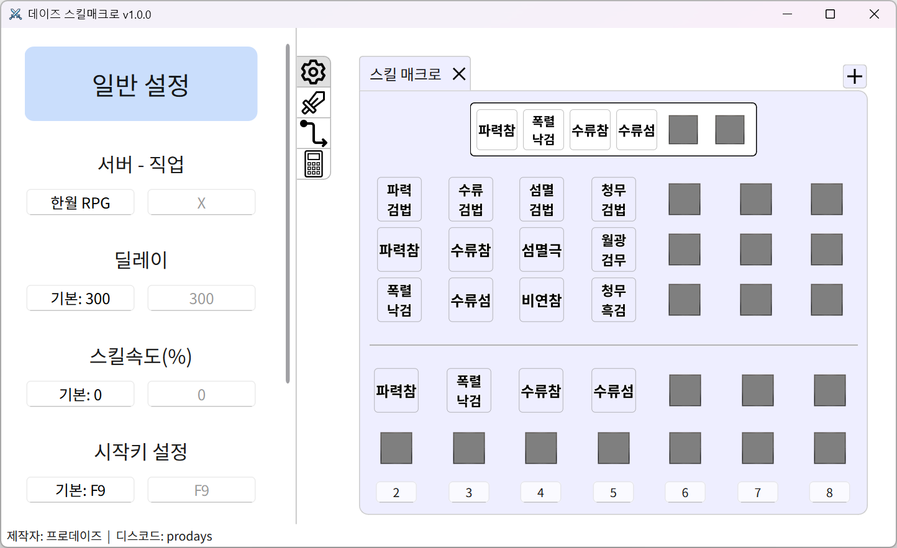

# 데이즈 스킬매크로

한월 RPG용 스킬 매크로, 전투 시뮬레이션, 스탯 최적화 프로그램입니다.

[프로그램 다운로드 및 업데이트 내역](https://github.com/Pro-Days/SkillMacro/releases)



## 사용 방법

프로그램을 처음 실행하면 기본 사용 가이드를 볼 수 있습니다.

가이드를 건너뛰었거나 다시 보고 싶다면 왼쪽 아래의 `?` 버튼을 눌러주세요. 매크로, 연계스킬, 계산기, 캐릭터 시스템의 사용법을 확인할 수 있습니다.

## 소스코드로 실행

Python 3.12 환경을 권장합니다.

```bash
pip install -r requirements.txt
python SkillMacro.py
```

## 데이터 저장 위치

프리셋, 커스텀 무공비급, 캐릭터 정보는 아래 경로에 자동 저장됩니다.

`%LOCALAPPDATA%\ProDays\SkillMacro`

프로그램을 종료한 뒤 이 폴더를 복사하면 데이터를 백업하거나 다른 PC로 옮길 수 있습니다.

## 제작자 및 라이선스

- GitHub: [@Pro-Days](https://github.com/Pro-Days)
- 라이선스: [GPL-3.0](LICENSE)
